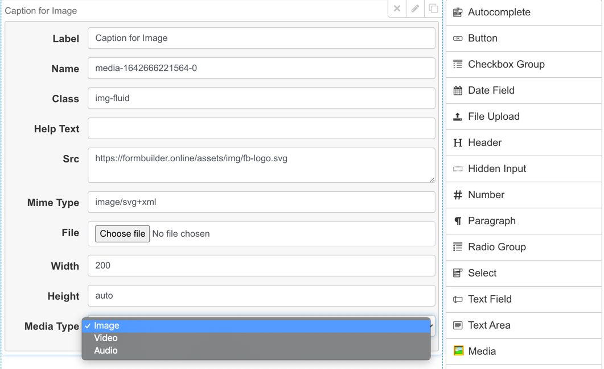
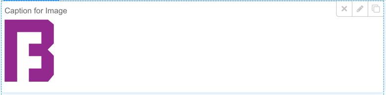

# Media (Image/Video/Audio) plugin for kevinchappell/formBuilder


A plugin to embed images, video, or audio into a formBuilder form.

## Features
* Renders HTML5 elements - Figure, Video, Audio
* Supports embedding via:
  * URL
  * DataURI
  * File Upload

## Installation

Include the plugin after formBuilder/formRender JS include

```<script src="media.js"></script>```

## Configuration
Un-used attributes "placeholder" and "required" are presented in the edit panel. These can be removed via configuring typeUserDisabledAttrs in formBuilder

```javascript
typeUserDisabledAttrs: {
    media: [
        'placeholder',
        'required',
    ]
}
```

## Notes on File Upload support
Media will install a default file upload handler. The default handler will convert uploads to DataURIs in the browser and stored in the **src** field attribute. It is recommended that when processing the formBuilder template on the backend that the DataURI is uploaded (for example to a S3 bucket) and the **src** attribute is modified to point to the public URL.
* For large files it is recommended to manually upload media outside formBuilder and link to the public URL instead of using the file upload support

### Disabling the default file upload handler
The default file handler can be disabled by setting the control option `default_change_handler` to false.

```javascript
controlConfig: {
     'media.image': {
        default_change_handler: false,
      }
      //@NOTE Need to repeat config for media.video and media.image since Formbuilder does not load controlControl for parent type
```

### Setting a custom file handler
A custom file upload handler can be set via assigning an event handling function the control option `change_handler`. The callback should accept an Event as the first parameter

```javascript
controlConfig: {
     'media.image': {
        change_handler: (event) => {}
      }
      //@NOTE Need to repeat config for media.video and media.image since Formbuilder does not load controlControl for parent type
```

Alternatively an event listener can be added to the file input fields selected by '.form-builder .frm-holder .fld-media-file-upload'

## Security recommendations
By default, any media src will be loaded. It is recommended to use a Content Security Policy to restrict where images and media can be loaded from

## Images


